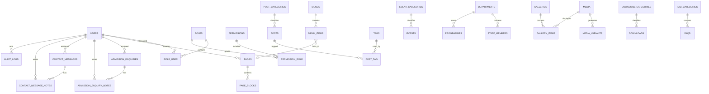

# DATABASE DESIGN — St. Charles Borromeo Website and Administration System

**Database:** MySQL 8.0+  
**Storage engine:** InnoDB  
**Character set:** `utf8mb4`  
**Recommended collation:** `utf8mb4_unicode_ci`  
**Application:** Laravel 12.x and Filament 5.x
**Status:** Binding initial design; Codex may refine it only through a documented decision that preserves all requirements.

---

## 1. Design goals

The database must:

1. support every public website and Filament administration screen;
2. make MySQL the authoritative source of operational data;
3. preserve publication workflow and scheduling;
4. enforce role-based access through application policies backed by normalized role data;
5. protect child media through consent-aware records and public query rules;
6. support searchable and indexed public listings;
7. support safe editing, soft deletion, restoration, and audit history;
8. allow seeded development content without using runtime fixtures;
9. avoid hiding real relationships inside JSON;
10. remain extensible without pretending that a parent or student portal exists in release one.

---

## 2. Global conventions

### 2.1 Keys

- Primary keys: unsigned `BIGINT` auto-increment unless otherwise specified.
- Foreign keys: unsigned `BIGINT`, indexed, with explicit delete rules.
- Public media may also have a UUID for non-sequential references.
- Pivot tables use composite primary or unique keys.

### 2.2 Time

- Store timestamps in UTC.
- Use Laravel timestamps: `created_at`, `updated_at`.
- Use `deleted_at` for soft-deletable resources.
- Use nullable publication fields only when absence has meaning.

### 2.3 Strings and slugs

- Human titles: `VARCHAR(255)`.
- Slugs: `VARCHAR(190)` to remain safely indexable.
- Email: `VARCHAR(255)` with normalized lowercase storage.
- Telephone: `VARCHAR(40)`, not numeric.
- URLs: `VARCHAR(2048)` when external.
- Status fields: `VARCHAR(32)` represented by PHP backed enums and validated by the application.

### 2.4 Text and JSON

- Short descriptions: `TEXT`.
- Article and rich page content: `LONGTEXT`.
- JSON is allowed for:
  - typed site-setting values;
  - bounded page-block options;
  - audit change snapshots;
  - revision snapshots;
  - external metadata that has no relational behaviour.
- Do not store categories, tags, roles, menu hierarchy, gallery ordering, or media usage as JSON.

### 2.5 Deletes

- Use `RESTRICT` for protected dependencies.
- Use `CASCADE` for true owned children such as page blocks and gallery items.
- Use `SET NULL` for optional creator, updater, assignee, and media references when preserving the parent record is important.
- Use soft deletes for public content, media metadata, users, enquiries, and downloads where recovery matters.

---

## 3. High-level ERD



---

## 4. Identity, access, sessions, and framework infrastructure

### 4.1 `users`

Purpose: administrator and contributor accounts.

Columns:

- `id BIGINT UNSIGNED PK`
- `name VARCHAR(255)`
- `email VARCHAR(255) UNIQUE`
- `email_verified_at TIMESTAMP NULL`
- `password VARCHAR(255)`
- `is_active BOOLEAN DEFAULT TRUE`
- `last_login_at TIMESTAMP NULL`
- `last_login_ip VARCHAR(45) NULL`
- `remember_token VARCHAR(100) NULL`
- `created_at`, `updated_at`
- `deleted_at TIMESTAMP NULL`

Indexes:

- unique `email`
- index `(is_active, deleted_at)`
- index `last_login_at`

Rules:

- soft deletion;
- inactive users cannot enter Filament;
- at least one protected super administrator must remain.

### 4.2 `roles`

- `id`
- `name VARCHAR(100)`
- `slug VARCHAR(100) UNIQUE`
- `description TEXT NULL`
- `is_system BOOLEAN DEFAULT FALSE`
- timestamps

Seed roles:

- `super-administrator`
- `school-administrator`
- `content-editor`
- `admissions-officer`
- `teacher-contributor`

### 4.3 `permissions`

- `id`
- `name VARCHAR(150)`
- `slug VARCHAR(150) UNIQUE`
- `group_name VARCHAR(100)`
- `description TEXT NULL`
- timestamps

Permission examples:

- `pages.view`
- `pages.create`
- `pages.update`
- `pages.publish`
- `media.approve`
- `admissions.export`
- `users.manage`
- `audit.view`

### 4.4 `role_user`

- `role_id FK -> roles.id ON DELETE CASCADE`
- `user_id FK -> users.id ON DELETE CASCADE`
- `assigned_by FK -> users.id NULL ON DELETE SET NULL`
- `created_at`
- composite unique `(role_id, user_id)`

### 4.5 `permission_role`

- `permission_id FK -> permissions.id ON DELETE CASCADE`
- `role_id FK -> roles.id ON DELETE CASCADE`
- composite primary or unique `(permission_id, role_id)`

### 4.6 Laravel infrastructure tables

Use standard Laravel-compatible structures for:

- `password_reset_tokens`
- `sessions`
- `cache`
- `cache_locks`
- `jobs`
- `job_batches`
- `failed_jobs`
- `notifications`

All must be created in MySQL when their database drivers are enabled.

---

## 5. Site identity, settings, navigation, and pages

### 5.1 `site_settings`

Purpose: school identity, official contacts, social links, office hours, SEO defaults, mail display settings, and controlled feature options.

Columns:

- `id`
- `group_name VARCHAR(100)`
- `setting_key VARCHAR(150)`
- `value_json JSON`
- `value_type VARCHAR(32)`
- `is_public BOOLEAN DEFAULT FALSE`
- `updated_by FK -> users.id NULL ON DELETE SET NULL`
- timestamps
- unique `(group_name, setting_key)`

Examples:

- `identity.school_name`
- `identity.motto`
- `contact.primary_email`
- `contact.telephone`
- `contact.address`
- `contact.map_url`
- `social.facebook_url`
- `seo.default_title`
- `seo.default_description`

Do not hard-code these values in Blade.

### 5.2 `menus`

- `id`
- `name VARCHAR(150)`
- `location VARCHAR(100) UNIQUE`
- `status VARCHAR(32) DEFAULT 'active'`
- timestamps

Locations:

- `primary`
- `footer-school`
- `footer-resources`
- `footer-legal`

### 5.3 `menu_items`

- `id`
- `menu_id FK -> menus.id ON DELETE CASCADE`
- `parent_id FK -> menu_items.id NULL ON DELETE CASCADE`
- `page_id FK -> pages.id NULL ON DELETE SET NULL`
- `label VARCHAR(150)`
- `link_type VARCHAR(32)` values such as `page`, `url`, `route`
- `url VARCHAR(2048) NULL`
- `route_name VARCHAR(190) NULL`
- `target VARCHAR(20) DEFAULT '_self'`
- `icon VARCHAR(100) NULL`
- `sort_order INT UNSIGNED DEFAULT 0`
- `is_active BOOLEAN DEFAULT TRUE`
- timestamps

Indexes:

- `(menu_id, parent_id, sort_order)`
- `(menu_id, is_active)`

Validation:

- exactly one valid destination according to `link_type`;
- no circular parent hierarchy.

### 5.4 `pages`

- `id`
- `title VARCHAR(255)`
- `slug VARCHAR(190) UNIQUE`
- `page_type VARCHAR(64) DEFAULT 'standard'`
- `template_key VARCHAR(100) DEFAULT 'standard'`
- `status VARCHAR(32) DEFAULT 'draft'`
- `excerpt TEXT NULL`
- `featured_media_id FK -> media.id NULL ON DELETE SET NULL`
- `published_at TIMESTAMP NULL`
- `scheduled_at TIMESTAMP NULL`
- `seo_title VARCHAR(255) NULL`
- `seo_description VARCHAR(320) NULL`
- `canonical_url VARCHAR(2048) NULL`
- `og_title VARCHAR(255) NULL`
- `og_description VARCHAR(320) NULL`
- `og_media_id FK -> media.id NULL ON DELETE SET NULL`
- `robots_index BOOLEAN DEFAULT TRUE`
- `robots_follow BOOLEAN DEFAULT TRUE`
- `created_by FK -> users.id NULL ON DELETE SET NULL`
- `updated_by FK -> users.id NULL ON DELETE SET NULL`
- timestamps
- soft delete

Indexes:

- unique `slug`
- `(status, published_at)`
- `(page_type, status)`
- `(robots_index, status)`

Public visibility rule:

```text
status = published
AND published_at <= now
AND deleted_at IS NULL
```

### 5.5 `page_blocks`

Purpose: controlled page builder matching approved components.

Columns:

- `id`
- `page_id FK -> pages.id ON DELETE CASCADE`
- `block_type VARCHAR(64)`
- `heading VARCHAR(255) NULL`
- `subheading VARCHAR(255) NULL`
- `body LONGTEXT NULL`
- `media_id FK -> media.id NULL ON DELETE SET NULL`
- `settings JSON NULL`
- `sort_order INT UNSIGNED DEFAULT 0`
- `is_enabled BOOLEAN DEFAULT TRUE`
- `visible_from TIMESTAMP NULL`
- `visible_until TIMESTAMP NULL`
- timestamps

Allowed block types:

- `hero`
- `rich_text`
- `image_text`
- `call_to_action`
- `statistics`
- `feature_cards`
- `values`
- `staff_list`
- `programme_list`
- `testimonial`
- `latest_news`
- `upcoming_events`
- `gallery_preview`
- `downloads_list`
- `faq_accordion`
- `contact_details`
- `map_link`
- `video_embed`

Indexes:

- `(page_id, is_enabled, sort_order)`
- `(visible_from, visible_until)`

### 5.6 `content_revisions`

Purpose: revision-aware editing and rollback for important publishable resources.

- `id`
- `revisionable_type VARCHAR(190)`
- `revisionable_id BIGINT UNSIGNED`
- `revision_number INT UNSIGNED`
- `snapshot JSON`
- `change_summary VARCHAR(255) NULL`
- `created_by FK -> users.id NULL ON DELETE SET NULL`
- `created_at`
- unique `(revisionable_type, revisionable_id, revision_number)`
- index `(revisionable_type, revisionable_id, created_at)`

### 5.7 `redirects`

- `id`
- `source_path VARCHAR(1024) UNIQUE`
- `target_url VARCHAR(2048)`
- `http_status SMALLINT UNSIGNED DEFAULT 301`
- `is_active BOOLEAN DEFAULT TRUE`
- `hit_count BIGINT UNSIGNED DEFAULT 0`
- `last_hit_at TIMESTAMP NULL`
- `created_by FK -> users.id NULL ON DELETE SET NULL`
- timestamps

Index `(is_active, source_path)`.

---

## 6. Editorial content

### 6.1 `post_categories`

- `id`
- `name VARCHAR(150)`
- `slug VARCHAR(190) UNIQUE`
- `description TEXT NULL`
- `sort_order INT UNSIGNED DEFAULT 0`
- `is_active BOOLEAN DEFAULT TRUE`
- timestamps
- soft delete

### 6.2 `posts`

- `id`
- `post_category_id FK -> post_categories.id NULL ON DELETE SET NULL`
- `author_id FK -> users.id NULL ON DELETE SET NULL`
- `title VARCHAR(255)`
- `slug VARCHAR(190) UNIQUE`
- `excerpt TEXT NULL`
- `body LONGTEXT`
- `featured_media_id FK -> media.id NULL ON DELETE SET NULL`
- `status VARCHAR(32) DEFAULT 'draft'`
- `is_featured BOOLEAN DEFAULT FALSE`
- `published_at TIMESTAMP NULL`
- `scheduled_at TIMESTAMP NULL`
- SEO and Open Graph columns matching `pages`
- `created_by`, `updated_by` nullable user foreign keys
- timestamps
- soft delete

Indexes:

- `(status, published_at)`
- `(post_category_id, status, published_at)`
- `(is_featured, status, published_at)`
- full-text index on `(title, excerpt, body)` if MySQL search is selected.

### 6.3 `tags`

- `id`
- `name VARCHAR(100)`
- `slug VARCHAR(190) UNIQUE`
- timestamps

### 6.4 `post_tag`

- `post_id FK -> posts.id ON DELETE CASCADE`
- `tag_id FK -> tags.id ON DELETE CASCADE`
- unique `(post_id, tag_id)`
- index `(tag_id, post_id)`

### 6.5 `announcements`

- `id`
- `title VARCHAR(255)`
- `message TEXT`
- `severity VARCHAR(32) DEFAULT 'info'`
- `status VARCHAR(32) DEFAULT 'draft'`
- `starts_at TIMESTAMP NULL`
- `ends_at TIMESTAMP NULL`
- `link_label VARCHAR(150) NULL`
- `link_url VARCHAR(2048) NULL`
- `is_dismissible BOOLEAN DEFAULT TRUE`
- `created_by`, `updated_by` nullable user foreign keys
- timestamps
- soft delete

Indexes:

- `(status, starts_at, ends_at)`
- `(severity, status)`

---

## 7. Events

### 7.1 `event_categories`

- `id`
- `name VARCHAR(150)`
- `slug VARCHAR(190) UNIQUE`
- `description TEXT NULL`
- `is_active BOOLEAN DEFAULT TRUE`
- timestamps
- soft delete

### 7.2 `events`

- `id`
- `event_category_id FK -> event_categories.id NULL ON DELETE SET NULL`
- `title VARCHAR(255)`
- `slug VARCHAR(190) UNIQUE`
- `summary TEXT NULL`
- `body LONGTEXT NULL`
- `featured_media_id FK -> media.id NULL ON DELETE SET NULL`
- `starts_at TIMESTAMP`
- `ends_at TIMESTAMP NULL`
- `timezone VARCHAR(64)`
- `venue_name VARCHAR(255) NULL`
- `venue_address TEXT NULL`
- `map_url VARCHAR(2048) NULL`
- `registration_url VARCHAR(2048) NULL`
- `programme_download_id FK -> downloads.id NULL ON DELETE SET NULL`
- `event_state VARCHAR(32) DEFAULT 'scheduled'`
- `publication_status VARCHAR(32) DEFAULT 'draft'`
- `published_at TIMESTAMP NULL`
- SEO/Open Graph columns
- creator/updater foreign keys
- timestamps
- soft delete

Indexes:

- `(publication_status, starts_at)`
- `(event_category_id, publication_status, starts_at)`
- `(event_state, starts_at)`
- `(starts_at, ends_at)`

Validation:

- `ends_at >= starts_at` when present.

---

## 8. School information

### 8.1 `departments`

- `id`
- `name VARCHAR(190)`
- `slug VARCHAR(190) UNIQUE`
- `description TEXT NULL`
- `email VARCHAR(255) NULL`
- `telephone VARCHAR(40) NULL`
- `sort_order INT UNSIGNED DEFAULT 0`
- `is_active BOOLEAN DEFAULT TRUE`
- timestamps
- soft delete

### 8.2 `programmes`

- `id`
- `department_id FK -> departments.id NULL ON DELETE SET NULL`
- `name VARCHAR(255)`
- `slug VARCHAR(190) UNIQUE`
- `programme_type VARCHAR(64)`
- `level VARCHAR(100) NULL`
- `summary TEXT NULL`
- `body LONGTEXT NULL`
- `featured_media_id FK -> media.id NULL ON DELETE SET NULL`
- `sort_order INT UNSIGNED DEFAULT 0`
- `status VARCHAR(32) DEFAULT 'draft'`
- `published_at TIMESTAMP NULL`
- SEO columns
- creator/updater foreign keys
- timestamps
- soft delete

Indexes:

- `(status, published_at)`
- `(department_id, status, sort_order)`
- `(programme_type, status)`

### 8.3 `staff_members`

- `id`
- `department_id FK -> departments.id NULL ON DELETE SET NULL`
- `name VARCHAR(255)`
- `slug VARCHAR(190) UNIQUE`
- `job_title VARCHAR(190)`
- `staff_type VARCHAR(64) NULL`
- `approved_biography TEXT NULL`
- `photo_media_id FK -> media.id NULL ON DELETE SET NULL`
- `email VARCHAR(255) NULL`
- `telephone VARCHAR(40) NULL`
- `sort_order INT UNSIGNED DEFAULT 0`
- `is_leadership BOOLEAN DEFAULT FALSE`
- `is_public BOOLEAN DEFAULT TRUE`
- `is_active BOOLEAN DEFAULT TRUE`
- timestamps
- soft delete

Indexes:

- `(department_id, is_active, sort_order)`
- `(is_leadership, is_public, sort_order)`

Only explicitly approved fields may be rendered publicly.

---

## 9. Media, safeguarding, galleries, and files

### 9.1 `media`

- `id`
- `uuid CHAR(36) UNIQUE`
- `disk VARCHAR(64)`
- `directory VARCHAR(255)`
- `stored_name VARCHAR(255)`
- `original_name VARCHAR(255)`
- `mime_type VARCHAR(150)`
- `extension VARCHAR(20)`
- `size_bytes BIGINT UNSIGNED`
- `width INT UNSIGNED NULL`
- `height INT UNSIGNED NULL`
- `checksum_sha256 CHAR(64)`
- `alt_text VARCHAR(500) NULL`
- `caption TEXT NULL`
- `credit VARCHAR(255) NULL`
- `focal_x DECIMAL(5,2) NULL`
- `focal_y DECIMAL(5,2) NULL`
- `visibility VARCHAR(32) DEFAULT 'private'`
- `consent_required BOOLEAN DEFAULT FALSE`
- `consent_confirmed BOOLEAN DEFAULT FALSE`
- `consent_reference VARCHAR(255) NULL`
- `publication_restricted BOOLEAN DEFAULT FALSE`
- `restriction_reason TEXT NULL`
- `is_protected_asset BOOLEAN DEFAULT FALSE`
- `uploaded_by FK -> users.id NULL ON DELETE SET NULL`
- timestamps
- soft delete

Constraints and indexes:

- unique `(disk, directory, stored_name)`
- index `(visibility, publication_restricted, deleted_at)`
- index `(consent_required, consent_confirmed)`
- index `uploaded_by`
- optional unique checksum policy depending on whether duplicate files are allowed.

Public media rule:

```text
visibility = public
AND publication_restricted = false
AND (
    consent_required = false
    OR consent_confirmed = true
)
AND deleted_at IS NULL
```

The exact school logo is stored as `is_protected_asset = true` and cannot be replaced or deleted through routine actions.

### 9.2 `media_variants`

- `id`
- `media_id FK -> media.id ON DELETE CASCADE`
- `variant_key VARCHAR(100)`
- `disk VARCHAR(64)`
- `path VARCHAR(1024)`
- `mime_type VARCHAR(150)`
- `width INT UNSIGNED NULL`
- `height INT UNSIGNED NULL`
- `size_bytes BIGINT UNSIGNED`
- `checksum_sha256 CHAR(64)`
- timestamps
- unique `(media_id, variant_key)`

Examples: `webp-768`, `webp-1280`, `webp-1920`, `thumbnail`.

### 9.3 `media_usages`

Purpose: trace where media is used.

- `id`
- `media_id FK -> media.id ON DELETE CASCADE`
- `usable_type VARCHAR(190)`
- `usable_id BIGINT UNSIGNED`
- `field_name VARCHAR(100)`
- `created_at`
- unique `(media_id, usable_type, usable_id, field_name)`
- index `(usable_type, usable_id)`

### 9.4 `gallery_categories`

- `id`
- `name VARCHAR(150)`
- `slug VARCHAR(190) UNIQUE`
- `sort_order INT UNSIGNED DEFAULT 0`
- `is_active BOOLEAN DEFAULT TRUE`
- timestamps

### 9.5 `galleries`

- `id`
- `gallery_category_id FK -> gallery_categories.id NULL ON DELETE SET NULL`
- `title VARCHAR(255)`
- `slug VARCHAR(190) UNIQUE`
- `description TEXT NULL`
- `cover_media_id FK -> media.id NULL ON DELETE SET NULL`
- `event_date DATE NULL`
- `status VARCHAR(32) DEFAULT 'draft'`
- `published_at TIMESTAMP NULL`
- `sort_order INT UNSIGNED DEFAULT 0`
- creator/updater foreign keys
- timestamps
- soft delete

Indexes `(status, published_at)` and `(gallery_category_id, status)`.

### 9.6 `gallery_items`

- `id`
- `gallery_id FK -> galleries.id ON DELETE CASCADE`
- `media_id FK -> media.id ON DELETE RESTRICT`
- `caption TEXT NULL`
- `sort_order INT UNSIGNED DEFAULT 0`
- `is_featured BOOLEAN DEFAULT FALSE`
- timestamps
- unique `(gallery_id, media_id)`
- index `(gallery_id, sort_order)`

Publication must validate the linked media consent state.

### 9.7 `download_categories`

- `id`
- `name VARCHAR(150)`
- `slug VARCHAR(190) UNIQUE`
- `description TEXT NULL`
- `sort_order INT UNSIGNED DEFAULT 0`
- `is_active BOOLEAN DEFAULT TRUE`
- timestamps
- soft delete

### 9.8 `downloads`

- `id`
- `download_category_id FK -> download_categories.id NULL ON DELETE SET NULL`
- `title VARCHAR(255)`
- `slug VARCHAR(190) UNIQUE`
- `description TEXT NULL`
- `media_id FK -> media.id ON DELETE RESTRICT`
- `version VARCHAR(50) NULL`
- `publication_date DATE NULL`
- `status VARCHAR(32) DEFAULT 'draft'`
- `published_at TIMESTAMP NULL`
- `download_count BIGINT UNSIGNED DEFAULT 0`
- creator/updater foreign keys
- timestamps
- soft delete

Indexes:

- `(status, published_at)`
- `(download_category_id, status, publication_date)`
- `(download_count)`

Increment counts atomically and avoid exposing private media paths.

---

## 10. FAQs

### 10.1 `faq_categories`

- `id`
- `name VARCHAR(150)`
- `slug VARCHAR(190) UNIQUE`
- `sort_order INT UNSIGNED DEFAULT 0`
- `is_active BOOLEAN DEFAULT TRUE`
- timestamps

### 10.2 `faqs`

- `id`
- `faq_category_id FK -> faq_categories.id NULL ON DELETE SET NULL`
- `question VARCHAR(500)`
- `answer LONGTEXT`
- `sort_order INT UNSIGNED DEFAULT 0`
- `status VARCHAR(32) DEFAULT 'draft'`
- `published_at TIMESTAMP NULL`
- creator/updater foreign keys
- timestamps
- soft delete

Indexes:

- `(faq_category_id, status, sort_order)`
- `(status, published_at)`
- optional full-text `(question, answer)`.

---

## 11. Enquiries and private workflow data

### 11.1 `admission_enquiries`

- `id`
- `reference_code VARCHAR(40) UNIQUE`
- `guardian_name VARCHAR(255)`
- `email VARCHAR(255)`
- `telephone VARCHAR(40)`
- `intended_level VARCHAR(150) NULL`
- `intended_term VARCHAR(100) NULL`
- `intended_year SMALLINT UNSIGNED NULL`
- `preferred_contact_method VARCHAR(32) NULL`
- `message TEXT NULL`
- `consent_confirmed BOOLEAN`
- `status VARCHAR(32) DEFAULT 'new'`
- `assigned_to FK -> users.id NULL ON DELETE SET NULL`
- `source_ip_hash CHAR(64) NULL`
- `user_agent_hash CHAR(64) NULL`
- `responded_at TIMESTAMP NULL`
- `closed_at TIMESTAMP NULL`
- timestamps
- soft delete

Indexes:

- `(status, created_at)`
- `(assigned_to, status, created_at)`
- `email`
- `telephone`
- `intended_year`

Do not collect sensitive child documents in this table.

### 11.2 `admission_enquiry_notes`

- `id`
- `admission_enquiry_id FK -> admission_enquiries.id ON DELETE CASCADE`
- `user_id FK -> users.id NULL ON DELETE SET NULL`
- `note TEXT`
- `is_sensitive BOOLEAN DEFAULT TRUE`
- `created_at`, `updated_at`

Index `(admission_enquiry_id, created_at)`.

Notes are never exposed publicly.

### 11.3 `contact_messages`

- `id`
- `reference_code VARCHAR(40) UNIQUE`
- `full_name VARCHAR(255)`
- `email VARCHAR(255)`
- `telephone VARCHAR(40) NULL`
- `subject VARCHAR(255)`
- `message TEXT`
- `consent_confirmed BOOLEAN`
- `status VARCHAR(32) DEFAULT 'new'`
- `assigned_to FK -> users.id NULL ON DELETE SET NULL`
- `source_ip_hash CHAR(64) NULL`
- `user_agent_hash CHAR(64) NULL`
- `responded_at TIMESTAMP NULL`
- `closed_at TIMESTAMP NULL`
- timestamps
- soft delete

Indexes:

- `(status, created_at)`
- `(assigned_to, status, created_at)`
- `email`

### 11.4 `contact_message_notes`

- `id`
- `contact_message_id FK -> contact_messages.id ON DELETE CASCADE`
- `user_id FK -> users.id NULL ON DELETE SET NULL`
- `note TEXT`
- `is_sensitive BOOLEAN DEFAULT TRUE`
- timestamps

Index `(contact_message_id, created_at)`.

---

## 12. Audit and accountability

### 12.1 `audit_logs`

- `id`
- `actor_id FK -> users.id NULL ON DELETE SET NULL`
- `action VARCHAR(100)`
- `subject_type VARCHAR(190) NULL`
- `subject_id BIGINT UNSIGNED NULL`
- `description VARCHAR(500) NULL`
- `old_values JSON NULL`
- `new_values JSON NULL`
- `ip_address VARCHAR(45) NULL`
- `user_agent TEXT NULL`
- `request_id CHAR(36) NULL`
- `created_at`

Indexes:

- `(actor_id, created_at)`
- `(subject_type, subject_id, created_at)`
- `(action, created_at)`
- `request_id`

Audit logs are append-only through the application. Routine administrators cannot edit them.

---

## 13. Search strategy

Initial implementation may use MySQL full-text indexes for:

- `pages(title, excerpt)`
- `posts(title, excerpt, body)`
- `events(title, summary, body)`
- `programmes(name, summary, body)`
- `faqs(question, answer)`
- `downloads(title, description)`

Search queries must always apply publication and safeguarding scopes before returning results.

Do not expose:

- draft content;
- archived content;
- soft-deleted records;
- internal notes;
- private media;
- unconfirmed child media;
- enquiry records.

If a dedicated search engine is added later, MySQL remains authoritative and indexing must be asynchronous and reproducible.

---

## 14. Recommended status values

Use PHP backed enums with string database columns.

### Publishable content

- `draft`
- `pending_review`
- `scheduled`
- `published`
- `archived`

### Media visibility

- `private`
- `review`
- `public`
- `archived`

### Enquiries

- `new`
- `in_progress`
- `responded`
- `closed`
- `spam`

### Event state

- `scheduled`
- `ongoing`
- `completed`
- `cancelled`

Do not confuse event state with publication status.

---

## 15. Migration order

Codex must create migrations in a dependency-safe sequence:

1. framework infrastructure tables;
2. users;
3. roles and permissions;
4. role and permission pivots;
5. media;
6. media variants and usages;
7. site settings;
8. pages;
9. page blocks and revisions;
10. menus and menu items;
11. post categories, tags, posts, pivots, announcements;
12. download categories and downloads;
13. event categories and events;
14. departments, programmes, staff members;
15. gallery categories, galleries, gallery items;
16. FAQ categories and FAQs;
17. admission enquiries and notes;
18. contact messages and notes;
19. redirects;
20. audit logs;
21. full-text and composite indexes that require all columns to exist.

Where circular references exist, such as events referencing downloads while downloads reference media, create the base tables first and add the optional foreign key in a later migration.

---

## 16. Seed plan

Required seeders:

1. `RolePermissionSeeder`
2. `LocalAdminSeeder`
3. `SiteSettingSeeder`
4. `MenuSeeder`
5. `MediaSeeder`
6. `PageSeeder`
7. `EditorialSeeder`
8. `EventSeeder`
9. `SchoolInformationSeeder`
10. `GallerySeeder`
11. `DownloadSeeder`
12. `FaqSeeder`
13. optional `DemoEnquirySeeder` for local environment only

Rules:

- Seed into MySQL.
- Use supplied school assets.
- Mark placeholder content clearly.
- Never invent official school facts.
- Do not run demo enquiry seeding in production.
- Seeders must be repeatable or safe after `migrate:fresh`.

---

## 17. Query ownership by screen

### Public site

- Home: `pages`, `page_blocks`, `site_settings`, published `posts`, upcoming `events`, public `media`.
- About: page and controlled blocks, leadership staff, approved media.
- Academics: programmes, departments, page blocks.
- Admissions: page blocks, downloads, FAQs, admission enquiry persistence.
- News: posts, categories, tags.
- Events: events and event categories.
- Gallery: galleries, gallery items, public consent-approved media.
- Downloads: downloads, categories, public media.
- Contact: public site settings plus contact-message persistence.
- Header/footer: menus, menu items, site settings.
- Search: published records only.
- SEO: record SEO columns and site defaults.

### Filament

- Dashboard: aggregate MySQL queries for content, enquiries, users, pending approvals, and upcoming events.
- Resources: Eloquent-backed tables and forms.
- Audit log: read-only MySQL audit records.
- Settings: `site_settings`.
- Users and roles: normalized identity tables.
- Media: media metadata, variants, usage, consent state.
- Enquiries: private records and notes with policies.

No screen may use static demo values after the relevant tables and seeders exist.

---

## 18. Required database tests

Codex must implement:

1. MySQL connection smoke test.
2. Clean migration test.
3. Seed completeness test.
4. Foreign-key action tests.
5. Unique slug tests.
6. Publication-scope tests.
7. Schedule visibility tests.
8. Soft-delete and restore tests.
9. Child-media consent enforcement tests.
10. Private media URL rejection tests.
11. Role and permission assignment tests.
12. Enquiry persistence and status tests.
13. Internal-note privacy tests.
14. Dashboard metric correctness tests.
15. MySQL test-environment guard.
16. N+1 query checks for home, news, events, gallery, and Filament dashboard.

---

## 19. Database milestone acceptance checklist

Codex may proceed beyond database design only when:

- [ ] MySQL 8.0+ is confirmed.
- [ ] No SQLite or PostgreSQL active configuration exists.
- [ ] ERD is documented.
- [ ] Every table has a stated purpose.
- [ ] Every column has type, nullability, and default documented.
- [ ] Every foreign key has an intentional delete rule.
- [ ] Unique constraints are documented.
- [ ] Composite indexes match expected queries.
- [ ] Migration order is validated.
- [ ] Seed plan maps to every visible prototype content region.
- [ ] Public visibility scopes are specified.
- [ ] Child-media consent logic is specified.
- [ ] Private enquiry boundaries are specified.
- [ ] Testing uses a separate MySQL schema.
- [ ] Destructive-command environment guards are planned.
- [ ] Unresolved decisions are documented instead of silently guessed.
