# Entity Relationship Diagram

```mermaid
erDiagram
    USERS ||--o{ ROLE_USER : assigned
    ROLES ||--o{ ROLE_USER : contains
    ROLES ||--o{ PERMISSION_ROLE : grants
    PERMISSIONS ||--o{ PERMISSION_ROLE : included

    USERS ||--o{ PAGES : creates
    USERS ||--o{ PAGES : updates
    MEDIA ||--o{ PAGES : featured_on
    PAGES ||--o{ PAGE_BLOCKS : contains
    MEDIA ||--o{ PAGE_BLOCKS : used_by
    PAGES ||--o{ CONTENT_REVISIONS : revised_as

    MENUS ||--o{ MENU_ITEMS : contains
    MENU_ITEMS ||--o{ MENU_ITEMS : nests
    PAGES ||--o{ MENU_ITEMS : links_to

    POST_CATEGORIES ||--o{ POSTS : classifies
    USERS ||--o{ POSTS : authors
    MEDIA ||--o{ POSTS : featured_on
    POSTS ||--o{ POST_TAG : tagged
    TAGS ||--o{ POST_TAG : used_by

    EVENT_CATEGORIES ||--o{ EVENTS : classifies
    MEDIA ||--o{ EVENTS : featured_on
    DOWNLOADS ||--o{ EVENTS : programme_file

    DEPARTMENTS ||--o{ PROGRAMMES : owns
    DEPARTMENTS ||--o{ STAFF_MEMBERS : contains
    MEDIA ||--o{ PROGRAMMES : featured_on
    MEDIA ||--o{ STAFF_MEMBERS : portrait

    MEDIA ||--o{ MEDIA_VARIANTS : generates
    MEDIA ||--o{ MEDIA_USAGES : traced_in
    GALLERY_CATEGORIES ||--o{ GALLERIES : classifies
    MEDIA ||--o{ GALLERIES : cover
    GALLERIES ||--o{ GALLERY_ITEMS : contains
    MEDIA ||--o{ GALLERY_ITEMS : displayed

    DOWNLOAD_CATEGORIES ||--o{ DOWNLOADS : classifies
    MEDIA ||--o{ DOWNLOADS : file

    FAQ_CATEGORIES ||--o{ FAQS : contains
    USERS ||--o{ FAQS : verifies

    USERS ||--o{ ADMISSION_ENQUIRIES : assigned
    ADMISSION_ENQUIRIES ||--o{ ADMISSION_ENQUIRY_NOTES : has
    USERS ||--o{ ADMISSION_ENQUIRY_NOTES : writes

    USERS ||--o{ CONTACT_MESSAGES : assigned
    CONTACT_MESSAGES ||--o{ CONTACT_MESSAGE_NOTES : has
    USERS ||--o{ CONTACT_MESSAGE_NOTES : writes

    ADMISSION_ENQUIRIES ||--o{ EMAIL_REPLIES : receives
    CONTACT_MESSAGES ||--o{ EMAIL_REPLIES : receives
    USERS ||--o{ EMAIL_REPLIES : sends

    USERS ||--o{ AUDIT_LOGS : acts
```

## Notes

- Polymorphic usage tables are represented conceptually because Mermaid does not enforce Laravel morph relationships.
- Optional creator/updater relationships follow the same `users.id ON DELETE SET NULL` pattern across publishable content.
- Full foreign-key actions are listed in `docs/data-dictionary.md` and `docs/migration-order.md`.
